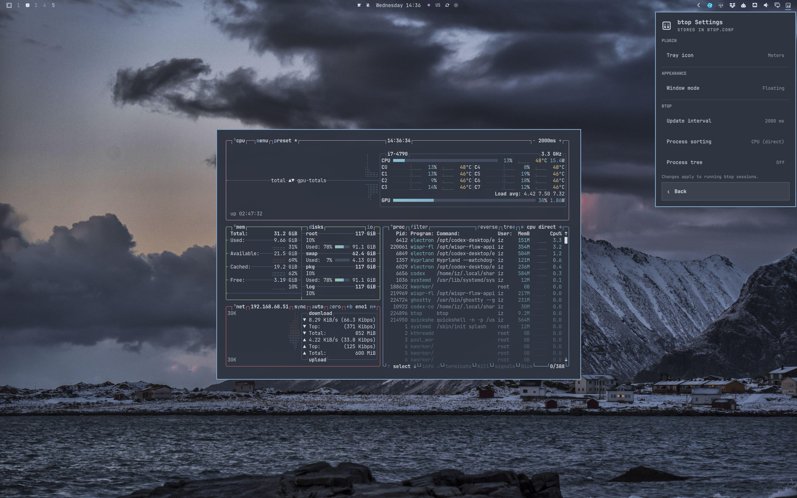

# btop Activity for Omarchy



Live CPU, RAM, and temperature activity in the Omarchy bar, with btop always
one click away. The default CPU icon follows the bar's normal foreground
color.

## Use

- **Left-click** the bar icon to start or focus btop in the selected window
  mode.
- **Right-click** the bar icon to open the plugin menu.
- Choose **Settings** to change the tray icon or basic btop options.
- Choose **Help** below the separator to open or focus btop in the selected
  window mode, directly on its built-in help screen. The same btop window is
  reused when possible.

The left meter shows CPU use and the right meter shows memory use. The menu is
also keyboard-friendly: use the arrow keys and Enter, or press `b`, `s`, or `?`
for btop, settings, or help.

Hovering shows RAM use, CPU use, and CPU temperature. The btop update interval
controls how often all three are sampled.

## Settings

The plugin keeps the short list of controls that is useful before opening btop:

| Setting         | Stored in   | Choices                                  |
|-----------------|-------------|------------------------------------------|
| Tray icon       | Omarchy     | Meters, CPU, Pulse, or a custom image    |
| Window mode     | Omarchy     | Floating or tiled                        |
| Update interval | Plugin      | 500, 1000, 2000, or 5000 milliseconds   |
| Process sorting | Plugin      | Lazy CPU, direct CPU, memory, or program |
| Process tree    | Plugin      | On or off                                |

Cycle **Tray icon** through **Meters**, **CPU**, **Pulse**, and **Custom**. The
custom path is stored separately, so switching between styles does not discard
it. **CPU** is the default for new installations.

For **Custom**, enter an absolute path, a `~/path`, or a `file://` URL, then
press Enter or **Save**. SVG and PNG work well. The plugin renders the file
as-is and does not recolor it. An invalid path shows `!`.

Depending on the installed icon themes, useful paths include:

- `/usr/share/icons/hicolor/scalable/apps/btop.svg`
- `/usr/share/icons/HighContrast/scalable/apps/utilities-system-monitor.svg`
- `/usr/share/icons/Yaru/scalable/apps/system-monitor-app-symbolic.svg`

The icon mode and custom path are stored in Omarchy's `shell.json` and survive
shell restarts.

Under **Appearance**, choose whether btop opens tiled or floating. The setting
applies to both left-click and Help, and Floating is the default.

## Install

```bash
omarchy plugin add https://github.com/ilyaZar/btop-quattro-plugin --enable
```

The plugin appears on the right side of the bar by default.

## Remove

```bash
omarchy plugin remove ilyazar.btop
```

Removing the plugin removes its private btop settings. It does not remove btop
or change btop's normal configuration.

## Config safety

The plugin launches btop with a private `.btop.conf` inside its checkout. Its
three btop controls change only that file; the normal user `btop.conf` is never
read or written.

The private file is created from Omarchy's packaged btop config only when btop
is opened or a btop setting is changed. Quickshell writes plugin changes
atomically, and a running btop receives its supported config-reload signal only
after a successful change. Native plugin removal deletes the private file with
the checkout.

## Requirements

- Omarchy Quattro
- btop, included with Omarchy

## Development

Link this repository into the local plugin folder and enable it:

```bash
ln -s "$PWD" ~/.config/omarchy/plugins/ilyazar.btop
omarchy-shell shell rescanPlugins
omarchy plugin enable ilyazar.btop --section right
```

`Service.qml` owns system sampling and the native Quickshell config bridge.
`BarWidget.qml` owns the bar icon, menu, and navigation.

## License

MIT
